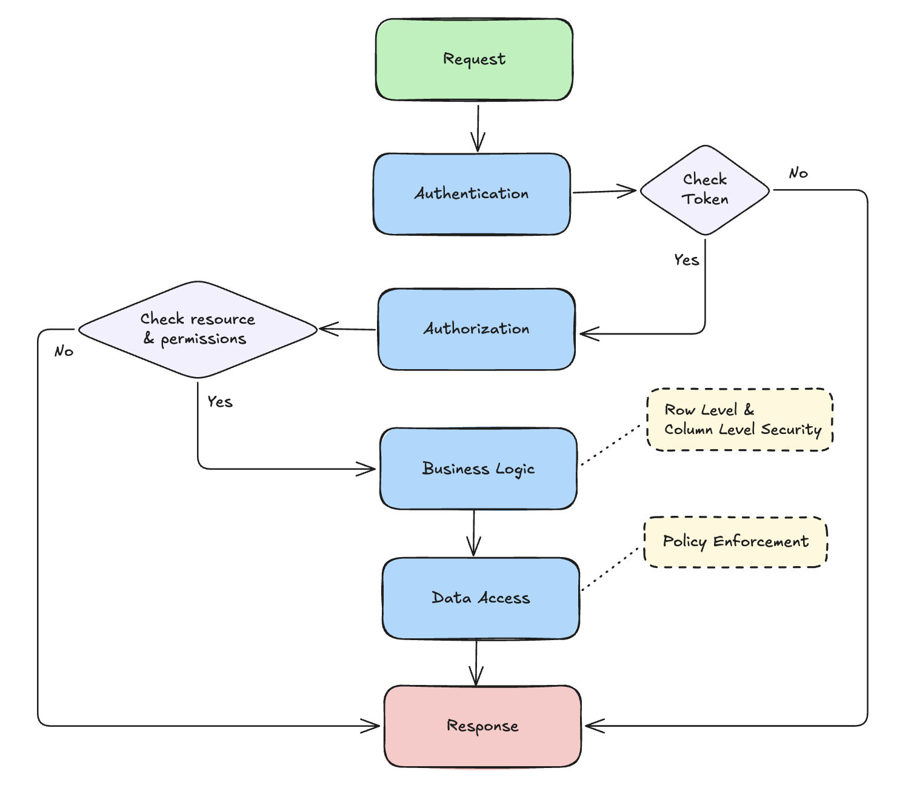

# Identity Service

The Identity system is designed with a **Security First** mindset, focusing on high performance and multi-layer security. Below is the architecture currently in operation:

## 1. Data Permission Levels
The system strictly controls data at the following levels:

- **Table Level:** Controls access to specific resource types (e.g., who can view `Invoice`, who can modify `Plan`).
- **Row Level:** Enforces **Multi-tenancy Isolation** by automatically injecting `tenant_id` into every query, preventing unauthorized cross-tenant data access.
- **Column Level:** Protects sensitive fields (e.g., passwords) via **DTOs** and masking at the application layer, ensuring only safe data leaves the service.

## 2. Security Layers
The protection flow is divided into distinct barrier layers:
1.  **Authentication:** Validates identity via JWT (Access Token).
2.  **Policy Definition:** Defines rules in the Database (`Permissions`, `Roles`, `Resources`).
3.  **Policy Evaluation:** Evaluates permissions instantly using **Bitmap** (decompressed from Token) directly at the Middleware.
4.  **Enforcement:** Forces the context (`UserID`, `TenantID`) to propagate through the Core Service via `context.Context`.

## 3. Request Lifecycle

## 4. Logical ERD

## 5. Optimization & Memory Management
- **High Performance Permission Check:** Uses **Bitmap** (Roaring Bitmap) data structures to check thousands of permissions in nanoseconds (bitwise operation) instead of continuous DB queries.
- **Cache Management:** Uses `TinyLFU` to cache hot data (Roles/Permissions), reducing database load.
- **Memory Management:** Leverages `context passing` to transport data efficiently (garbage free) between layers.

## 6. Database Design Concepts
- **REALM_ID (Tenant):** The backbone of the Multi-tenancy system.
- **USER EAV (Entity-Attribute-Value):** The `user_attribute_values` model allows for dynamic user information extension (Attribute-Based) without altering the table structure.
- **FEDERATION LINKS:** Supports federated login (`federated_identities`) separated from core users.
- **RBAC (Symmetric):** Permission model based on core Roles, easy to manage and scale.
