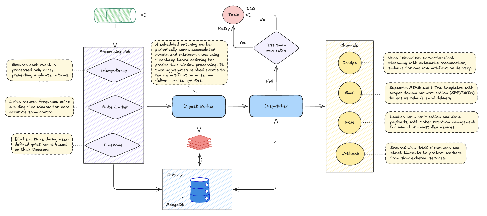

# Notification Service

High-performance, event-driven architecture designed to handle massive-scale notifications with advanced processing, intelligent aggregation, and guaranteed delivery through a resilient multi-layer pipeline.

## 1. Intelligent Processing Pipeline
The core gateway that ensures every event is validated and optimized before dispatching.

- **Idempotent Execution**: Leverages a Redis-backed distributed lock pattern. Each incoming event is hashed against its unique key to ensure **exactly-once processing**, effectively neutralizing the risk of duplicate notifications from upstream retries.
- **Sliding Window Throttling**: Unlike static counters, this implements a sliding time-window using Redis Sorted Sets (`ZSET`). It monitors velocity per user and channel, providing a precise shield against spamming while staying within infrastructure quotas.
- **Personalized Delivery Engine**: Dynamically resolves the user's local timezone. It enforces "Quiet Hours" policies by calculating the current time at the destination, ensuring non-critical alerts do not disturb users during their specific night hours.

## 2. Aggregation & Retention Layer
Mitigates notification fatigue and ensures data durability through sophisticated buffering.

- **Smart Digest Service**: Groups related events using logical `CollapseKeys`. Instead of immediate delivery, high-frequency events are accumulated in a Redis buffer to be processed as a single entity.
- **Background Aggregation Workers**: Scheduled workers sweep the aggregation buffer, merging multiple events into a single, high-value summary message, significantly reducing client-side noise.
- **Post-Consumption Outbox**: Adopts the Outbox Pattern by persisting every consumed event into MongoDB immediately. This creates a permanent audit trail and allows for recovery if downstream adapters fail during transit.

## 3. High-Fidelity Channel Dispatcher
A unified abstraction layer that translates domain events into native channel payloads.

- **Real-Time Web (SSE)**: Uses Server-Sent Events to push updates to active web clients with minimal overhead compared to WebSockets.
- **Mobile Push (FCM)**: Integrated with Firebase Cloud Messaging to handle system-level notifications on iOS and Android.
- **Transactional Email**: Generates and delivers complex HTML templates via Resend or SMTP, optimized for high deliverability.
- **Enterprise Webhooks**: Secure outbound POST requests with HMAC-SHA256 signing for third-party system integration.

## 4. Resilience & Error Handling
Engineered for fault tolerance to maintain high availability during infrastructure instability.

- **Event Sourcing via Kafka**: Decouples producer performance from delivery latency, allowing for massive bursts in traffic without degrading service stability.
- **Exponential Backoff Strategy**: In case of third-party provider downtime, the system automatically schedules retries with increasing delays, preventing further pressure on struggling services.
- **Dead Letter Queue (DLQ)**: Persistently failing messages are isolated into a dedicated Kafka DLQ topic, enabling offline analysis, manual intervention, and zero-loss re-processing.

