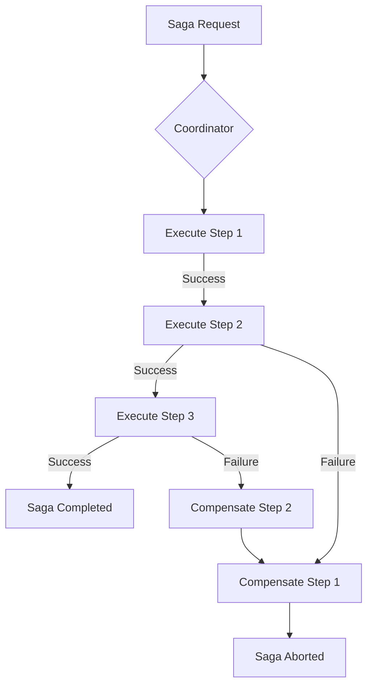

# Orchestrator Service

The Orchestrator system is the central engine for managing **Complex Distributed Transactions**, ensuring system-wide consistency across multiple microservices. Built on the **Saga Pattern**, it handles long-running workflows with high reliability and guaranteed atomicity.

## 1. Distributed Transaction Management (Saga Pattern)
The service manages multi-stage workflows that span across different service boundaries (e.g., User Registration, Plan Changes).

- **Execution Flow:** Coordinates the sequential execution of independent microservice operations.
- **Atomic Operations:** Ensures that a distributed transaction either completes in its entirety or is fully rolled back to a consistent state.
- **State Preservation:** Maintains the lifecycle of each saga, from initiation to success or failure.

## 2. Fail-safe Coordination & Compensation
The core strength of the Orchestrator is its ability to handle partial failures in a distributed environment.

- **Compensation Logic:** Automatically triggers **Reverse-order Rollbacks** (Compensating Transactions) if any step in the saga fails.
- **Reliable Rollback:** Each step implements a `Compensate` method to undo the actions taken during the `Execute` phase.
- **State Machine Integration:** Tracks the current state of each workflow to prevent inconsistent states during concurrent execution.

## 3. Consistency Layers
To ensure reliability beyond a single service instance, the Orchestrator integrates with advanced infrastructure patterns:

1.  **Transactional Integrity:** Guarantees that saga events are processed predictably and reliably.
2.  **Event Driven Integration:** Decouples the initiation of sagas from business services via High-Performance Message Queues (Kafka).
3.  **Persistence Layer:** Encapsulates the saga state in durable storage (Redis/Postgres), allowing workflows to resume even after a service restart.

## 4. Optimization & Efficiency
- **Lightweight Coordinator:** Designed with minimal overhead, allowing for high-throughput coordination of thousands of concurrent sagas.
- **Reverse Recovery:** Implements a strict "LIFO" (Last-In-First-Out) compensation strategy to minimize side effects during rollbacks.
- **Error Propagation:** Captures and propagates failure context across service boundaries for precise debugging and observability.

## 5. Logical Workflow Diagram
The system follows a strict **Orchestrator-based Saga** model:

## 6. Key Use Cases
- **User Registration:** Coordinates Identity creation, Profile initialization, and Welcome notification.
- **Subscription Lifecycle:** Manages the complexity of plan upgrades, billing adjustments, and capacity allocation.
- **Resource Provisioning:** Orchestrates the allocation of distributed resources across the GoLink ecosystem.
